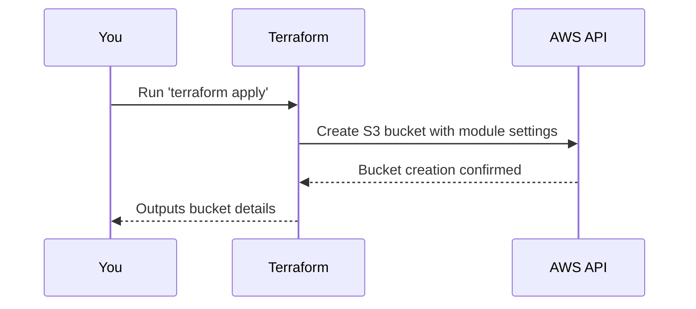

# Chapter 1: Example Usage

Welcome to the first chapter of our guide on using the `terraform-aws-mcaf-s3` module! 🎉 In this chapter, we will introduce the concept of "Example Usage." The goal is to help you quickly understand how to use this module with the help of example configurations. Think of these examples as **recipe cards**—prewritten "recipes" to get started with setting up an S3 bucket for specific needs like lifecycle rules, logging, or replication.

By the end of this chapter, you will:
- Understand what example modules are and why they're helpful.
- Learn how to use a basic example to create an S3 bucket.
- Peek under the hood to see how the module works.

Let's dive in! 🚀

---

## What Problem Does This Solve?

Amazon S3 is incredibly powerful but can be overwhelming for beginners because of its many features (lifecycle policies, bucket policies, replication, etc.).

For example:
Imagine you're tasked with **creating an S3 bucket** to store files while ensuring that:
- Any unused files are moved to cheaper storage after 30 days.
- Files older than 90 days are automatically deleted.

Sounds daunting, right? But fear not! The `terraform-aws-mcaf-s3` module, combined with its example configurations, makes this super easy. Instead of manually setting up everything, you can use pre-configured examples as a starting point.

---

## Key Concepts: Example Modules

### What are Example Modules?

**Example modules** are demo configurations that:
- Use the `terraform-aws-mcaf-s3` module.
- Showcase common use cases (like enabling versioning, lifecycle rules, or logging).
- Help you quickly learn how to set up an S3 bucket without starting from scratch.

### Why should you use them?

1. **Save time**: You don’t have to write everything from scratch.
2. **Learn by doing**: By testing these examples, you’ll get hands-on experience.
3. **Adapt and extend**: Start with an example, then tweak it for your specific needs.

---

## Using the Basic Example

Let’s start with our first example: creating a **basic S3 bucket**. This is one of the simplest configurations and perfect for beginners.

### Step 1: Write the Terraform File

Here’s a basic example of creating an S3 bucket in the `"eu-west-1"` region:

```hcl
provider "aws" {
  region = "eu-west-1" # Define the AWS region
}

module "basic" {
  source = "../.."         # Use the `terraform-aws-mcaf-s3` module
  name_prefix = "basic"    # Set a prefix for the bucket name
}
```

### Explanation of the Code
1. **Provider**: We start by specifying the AWS region where our resources will live.
2. **Module Block**: This is the heart of the configuration. We:
   - Specify the `source` path to use the `terraform-aws-mcaf-s3` module.
   - Set a `name_prefix`, so our bucket will have names like `basic-123abc456`.

### Step 2: Apply the Configuration

Use Terraform commands to create your bucket:
```bash
terraform init    # Initialize the Terraform project
terraform apply   # Apply the configuration
```

That's it! Terraform will create an S3 bucket for you with the given prefix.

---

## What Happens Under the Hood?

Whenever you call this module, here’s the sequence of events happening behind the scenes:



This flow shows how Terraform uses the AWS API to provision and configure your bucket for you.

Now let’s look at how this works inside the module.

---

## Internal Implementation

The `terraform-aws-mcaf-s3` module contains all the logic to create and configure your bucket. Here's a simplified breakdown:

### 1. **Input Variables**
Inputs like `name_prefix` are defined in a file called `variables.tf`. For example:
```hcl
variable "name_prefix" {
  type        = string
  description = "Prefix for the bucket name"
}
```

This helps the module accept user input (like `"basic"` in our example).

### 2. **Bucket Creation**
The bucket resource is created using Terraform's native S3 resource:
```hcl
resource "aws_s3_bucket" "this" {
  bucket_prefix = var.name_prefix
  acl           = "private"
}
```
Every time you pass a `name_prefix`, this section handles the actual bucket creation.

### 3. **Outputs**
The module provides outputs (like the bucket name or ARN). For instance:
```hcl
output "bucket_name" {
  value = aws_s3_bucket.this.bucket
}
```
This means once the bucket is created, you can retrieve its name using `module.<module_name>.bucket_name`.

---

## Recap & What’s Next?

Congratulations! 🎉 In this chapter, you learned:
- The purpose of example modules and how they can help you save time.
- How to use a **basic example** to create an S3 bucket.
- What happens internally when the module is called.

Now that you have a basic bucket working, let’s explore the next level—understanding the S3 resource itself. Check out [S3 Bucket Resource](02_s3_bucket_resource_.md) to learn more!

---

Generated by [AI Codebase Knowledge Builder](https://github.com/The-Pocket/Tutorial-Codebase-Knowledge)
