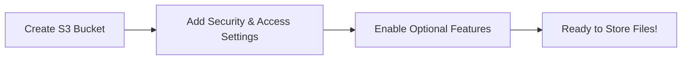
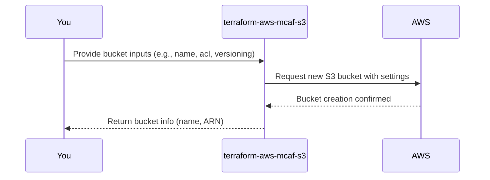

# Chapter 2: S3 Bucket Resource

Welcome to Chapter 2! In the [previous chapter](01_example_usage_.md), we took a look at how to use an example configuration to create an Amazon S3 bucket easily. Now it’s time to understand **what an S3 bucket actually is** and why it’s central to this module.

---

## What is an S3 Bucket?

Imagine you are organizing files on your computer. You create folders to store your documents, pictures, or any other files. In the AWS world, an **S3 bucket** is like that folder—but in the cloud! It’s a **digital container** where you can store, retrieve, and organize your data (like files, images, or even backups).

But an S3 bucket doesn’t stop there—it has powerful features like:
- **Security**: You can make your bucket private or public and control who can access it.
- **Versioning**: Keep track of different versions of your files.
- **Custom Rules**: Automatically move files to cheaper storage or delete old files.

---

### Why is This Important?

Let’s paint a picture:
You’re working for a company that takes lots of product images daily. You need a place to easily store thousands of pictures, ensure they don’t get lost, and archive old ones after a year. Sounds like a headache? Not with S3 buckets! 🙌 They simplify everything by providing:
1. **Unlimited Storage**: Store as much data as you need.
2. **High Availability**: Your files are accessible anytime, anywhere.
3. **Flexible Features**: Automation with rules (like backups, deletion, or storage class transitions).

The `terraform-aws-mcaf-s3` module takes this powerful concept and wraps it into a simple, reusable Terraform configuration so that you don’t need to set everything up manually!

---

## Key Concepts: S3 Bucket Resource

### 1. The Resource Itself
The **S3 bucket** is the base resource we define in our module. As soon as this bucket exists, you have your digital container in AWS. The module automatically configures essential features like:
- **Access Control List (ACL)**: Determines who can access the bucket.
- **Public Access Blocking**: Helps you secure the bucket.
- **Versioning**: Tracks changes to files over time, if enabled.

Here’s a conceptual flow:


---

## How to Use the S3 Bucket Resource

Let’s walk through an example to create a basic **private bucket** using the module.

### Step 1: Create a Simple Bucket

Here’s how you would define a Terraform file:

```hcl
module "bucket" {
  source      = "../.."         # Path to the terraform-aws-mcaf-s3 module
  name_prefix = "example"       # Give your bucket a name prefix
  acl         = "private"       # Default to private access
  versioning  = true            # Turn on file versioning
}
```

**Explanation:**
- `name_prefix`: Adds a prefix like `example-xxxxx` to your bucket name, ensuring it’s unique.
- `acl`: Sets the bucket to **private** so no one else can access your data.
- `versioning`: Ensures different versions of files are stored.

### Step 2: Apply the Configuration

Run the commands to create your bucket:
```bash
terraform init    # Initialize the Terraform project
terraform apply   # Apply the configuration
```

What will happen?
- Terraform will create an S3 bucket in AWS with the prefix `example-`.
- Versioning will be enabled. If you upload the same file again, the older file will still be stored (so nothing is accidentally overwritten).

---

### Output Example

After applying, you may see some outputs like:
```plaintext
module.bucket.bucket_name = example-xxxxx
module.bucket.bucket_arn  = arn:aws:s3:::example-xxxxx
```

- **Bucket Name**: Your unique bucket name (`example-xxxxx`).
- **Bucket ARN**: The Amazon Resource Name (ARN) for your bucket, which AWS uses to identify the bucket.

---

## What’s Happening Inside the Module?

Let’s take a quick tour under the hood to see how the **S3 bucket resource** is built.

### Step-by-Step Process

Here’s a simplified sequence of what happens when you use the module:



Behind the scenes, the module uses Terraform's `aws_s3_bucket` resource to create the bucket with all the settings you provided.

---

### Internal Implementation Highlights

1. **Defining the Bucket**
In the file `main.tf`, the bucket is created using the `aws_s3_bucket` resource:
```hcl
resource "aws_s3_bucket" "default" {
  bucket_prefix = var.name_prefix  # Use the prefix for uniqueness
  acl           = var.acl          # Set access control
}
```

2. **Enabling Versioning**
If you enable versioning, the module adds a versioning configuration:
```hcl
resource "aws_s3_bucket_versioning" "default" {
  bucket = aws_s3_bucket.default.id

  versioning_configuration {
    status = var.versioning ? "Enabled" : "Suspended"
  }
}
```

3. **Public Access Blocking**
By default, the module blocks any public access for security:
```hcl
resource "aws_s3_bucket_public_access_block" "default" {
  bucket                  = aws_s3_bucket.default.id
  block_public_acls       = true
  block_public_policy     = true
  ignore_public_acls      = true
  restrict_public_buckets = true
}
```

This ensures no one on the internet can access your bucket or its files.

---

## Recap & What’s Next?

Congratulations! 🎉 In this chapter, you learned:
- What an S3 bucket is and why it’s important.
- How the `terraform-aws-mcaf-s3` module makes creating S3 buckets easy.
- What happens under the hood when you deploy an S3 bucket.

You’ve now mastered the foundation of creating and using S3 buckets. In the [next chapter](03_bucket_policy___access_control_.md), we’ll explore how to control **who can access your bucket** using policies and access controls. Stay curious! 🌟

---

Generated by [AI Codebase Knowledge Builder](https://github.com/The-Pocket/Tutorial-Codebase-Knowledge)
