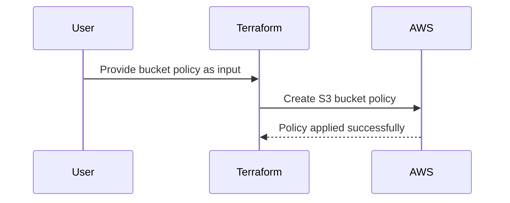

# Chapter 3: Bucket Policy & Access Control

Welcome to Chapter 3! 🎉 In the [previous chapter](02_s3_bucket_resource_.md), we explored what an S3 bucket is and how the `terraform-aws-mcaf-s3` module simplifies its creation. Now, it's time to learn about **Bucket Policies** and **Access Control**, which are essential for managing **who can access your bucket** and **what actions they can take**. Let's dive in! 🚀

---

## Why is Bucket Policy & Access Control Important?

Imagine your S3 bucket is a treasure chest filled with valuable data. Who should be allowed to open it? What if someone tries to access it without permission? 🤔

This is where **Bucket Policies and Access Control** play a critical role. They are like a security guard with a checklist:
- **Who is allowed?** Restrict access to specific users, roles, or systems.
- **What actions can they perform?** Allow or deny operations like reading files or uploading new ones.
- **Under what conditions?** For example, enforce secure (HTTPS) connections when accessing the bucket.

Without a proper policy, your data may accidentally become accessible to everyone on the internet. 😱 Let’s learn how to avoid that with some beginner-friendly examples.

---

## Key Concepts: Bucket Policy & Access Control

#### 1. **Bucket Policy**
A **bucket policy** is a JSON document that defines permissions directly on the bucket. It answers these questions:
- **Who** can access the bucket (principals like AWS users or roles)?
- **What** actions are allowed (e.g., `s3:GetObject`, `s3:PutObject`)?
- **What resources** are involved (the bucket or an object in the bucket)?
- **Under what conditions** (e.g., whether the request is over HTTPS)?

Think of it as a "rulebook" for your S3 bucket. 👮‍♀️

#### 2. **Access Control List (ACL)**
An **ACL** is a simpler alternative to control access. Instead of a detailed rulebook, it acts like a quick list of who has access (e.g., public, private, or specific accounts). However, ACLs are less flexible than bucket policies and are used less often for modern S3 configurations.

---

## Example Use Case: Enforcing Secure Access to Your Bucket

Let’s say your company uses an S3 bucket to store sensitive financial reports. You want to ensure:
1. Only the finance team can **read files** from the bucket.
2. All access must happen over a secure HTTPS connection.

We will solve this using a bucket policy!

### Step 1: Add a Bucket Policy in Terraform

Here’s an example of how to write a bucket policy using the `terraform-aws-mcaf-s3` module:

```hcl
module "secure_bucket" {
  source = "../.."       # Path to the module
  name_prefix = "secure" # Prefix for bucket name
  policy = jsonencode({
    "Version": "2012-10-17",
    "Statement": [
      {
        "Effect": "Deny",
        "Principal": "*",
        "Action": "s3:*",
        "Resource": "*",
        "Condition": {
          "Bool": {"aws:SecureTransport": "false"}
        }
      },
      {
        "Effect": "Allow",
        "Principal": {"AWS": ["arn:aws:iam::123456789012:role/FinanceTeamRole"]},
        "Action": ["s3:GetObject"],
        "Resource": ["arn:aws:s3:::secure-*/*"]
      }
    ]
  })
}
```

### What’s Happening Here?

1. **Deny Insecure Access**
   The first statement **denies all actions** (`s3:*`) if the connection is not over HTTPS (`aws:SecureTransport` is `false`). This ensures secure access.

2. **Allow Finance Team Access**
   The second statement **allows only the Finance team AWS role** (`arn:aws:iam::123456789012:role/FinanceTeamRole`) to read files from the bucket (`s3:GetObject`).

When you `terraform apply`, this bucket policy will automatically be applied to the bucket created by the module.

---

## Behind the Scenes: How the Module Implements Policies

To understand what happens inside the module, let’s break it down step-by-step.

### Step 1: Applying a Policy

When you provide the `policy` input, the module uses Terraform to attach a **bucket policy** to your S3 bucket. Here’s what happens visually:



### Step 2: Internal Implementation

Here’s the simplified code from the module that makes this happen:

#### 1. Define the Policy Input
The input variable `policy` is defined in [`variables.tf`](variables.tf). This is where the module accepts your custom bucket policy:
```hcl
variable "policy" {
  type        = string
  description = "A valid bucket policy JSON document."
}
```

#### 2. Attach the Policy to the Bucket
In [`main.tf`](main.tf), the `aws_s3_bucket_policy` resource is used to attach the policy:
```hcl
resource "aws_s3_bucket_policy" "default" {
  bucket = aws_s3_bucket.default.id
  policy = var.policy
}
```
- The `bucket` field refers to the name of the S3 bucket.
- The `policy` field takes the JSON document you provide.

#### 3. Verify HTTPS-only Access
The module includes a default policy that denies non-HTTPS access:
```hcl
data "aws_iam_policy_document" "ssl_policy" {
  statement {
    sid = "AllowSSLRequestsOnly"
    actions = ["s3:*"]
    effect = "Deny"
    resources = [
      aws_s3_bucket.default.arn,
      "${aws_s3_bucket.default.arn}/*"
    ]
    condition {
      test     = "Bool"
      variable = "aws:SecureTransport"
      values   = ["false"]
    }
  }
}
```
When you apply the Terraform configuration, this ensures that only secure connections are allowed.

---

## Common Debugging Tip

If you access your S3 bucket and get an error, double-check:
1. The **permissions** for the IAM role or user trying to access the bucket.
2. Whether the connection uses **HTTPS** (if enforcing SecureTransport).

You can also use Amazon S3 tools (like the AWS CLI) to test access:
```bash
aws s3 ls s3://secure-<bucket_name> --profile <profile_name>
```

---

## Recap & What’s Next?

Congratulations! 🎉 You’ve learned:
- What bucket policies and access control are and why they’re important.
- How to use the [terraform-aws-mcaf-s3](https://github.com/schubergphilis/terraform-aws-mcaf-s3) module to enforce access control.
- How to write a basic bucket policy to allow HTTPS-only connections and specific user access.

Now you’re ready to explore another critical layer of security—[Public Access Blocking](04_public_access_blocking_.md). This ensures your bucket isn’t accidentally exposed to the entire internet. Keep the momentum going! 🚀

---

Generated by [AI Codebase Knowledge Builder](https://github.com/The-Pocket/Tutorial-Codebase-Knowledge)
