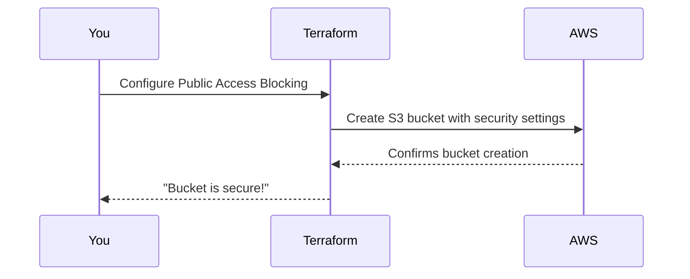

# Chapter 4: Public Access Blocking

Welcome to Chapter 4! 🎉 In the [previous chapter](03_bucket_policy___access_control_.md), we learned how to use bucket policies and access control to define who can access your S3 bucket and what they are allowed to do. But what if you want to take the security of your bucket a step further to ensure **NO public access is ever allowed**—no accidental sharing, no risks? 🤔

This is where **Public Access Blocking** comes in. It’s like putting a big sturdy lock on your digital storage room to make sure no one from the outside world can enter unless explicitly permitted. Let’s dive in! 🚀

---

## Why Public Access Blocking is Critical

Imagine your company has sensitive files stored in an S3 bucket—customer data, financial records, or product prototypes. One day, someone accidentally makes the bucket public, exposing all your data to the entire internet. 😱

That’s a real problem that has happened to many organizations. But you can prevent it by enabling **Public Access Blocking**, a feature that:
- Automatically denies all requests for public access to your bucket, even if someone attempts to override it with a policy.
- Helps enforce strict security best practices without leaving any room for accidental exposure.

---

## Key Concepts: Public Access Blocking

Public Access Blocking consists of four key settings:
1. **Block Public ACLs**: Prevents your bucket from applying public Access Control Lists (ACLs).
2. **Ignore Public ACLs**: Instructs the bucket to ignore any public ACLs that someone tries to apply.
3. **Block Public Policies**: Prevents any public bucket policies from being set.
4. **Restrict Public Buckets**: Ensures no public access, regardless of the circumstances.

Think of these as different layers of armor that prevent public access to your bucket, no matter how it’s configured. 🛡️

---

## How to Use Public Access Blocking in the Module

The `terraform-aws-mcaf-s3` module makes it super easy to enable public access blocking for your bucket. Let’s walk through a simple example.

### Step 1: Enable Public Access Blocking

Here’s how you can configure your S3 bucket to block all public access:

```hcl
module "secure_bucket" {
  source = "../.."         # Path to the module
  name_prefix = "secure"   # Prefix for your bucket's name

  block_public_acls   = true   # Block public ACLs
  ignore_public_acls  = true   # Ignore public ACLs
  block_public_policy = true   # Prevent public bucket policies
  restrict_public_buckets = true # Fully restrict public access
}
```

**What’s Happening Here?**
- **`block_public_acls`:** Blocks anyone from setting public ACLs on the bucket.
- **`ignore_public_acls`:** Ensures the bucket ignores any public ACLs, even if they exist.
- **`block_public_policy`:** Prevents any bucket policy from granting public access.
- **`restrict_public_buckets`:** Completely denies public access to the bucket.

### Step 2: Apply the Configuration

Run these Terraform commands to create the bucket with public access blocking in place:

```bash
terraform init    # Initialize your Terraform environment
terraform apply   # Apply the configuration to AWS
```

When the bucket is created, public access blocking settings will be automatically applied. Now, your bucket and its contents are locked down and private by default. 🔒

---

## What Happens Under the Hood?

To understand how public access blocking works inside the module, let’s break it down step-by-step. When you deploy the configuration above, several things happen:



### Internal Implementation

Let’s take a closer look at how the module implements public access blocking behind the scenes. 🔍

1. **Input Variables**
   The module accepts four variables to control public access blocking. These variables are defined in the `variables.tf` file:

   ```hcl
   variable "block_public_acls" {
     type        = bool
     default     = true
     description = "Whether Amazon S3 should block public ACLs for this bucket."
   }

   variable "ignore_public_acls" {
     type        = bool
     default     = true
     description = "Whether Amazon S3 should ignore public ACLs for this bucket."
   }

   variable "block_public_policy" {
     type        = bool
     default     = true
     description = "Whether Amazon S3 should block public bucket policies for this bucket."
   }

   variable "restrict_public_buckets" {
     type        = bool
     default     = true
     description = "Whether Amazon S3 should restrict public bucket policies for this bucket."
   }
   ```

2. **Applying the Public Access Block**
   These settings are applied using the `aws_s3_bucket_public_access_block` resource in `main.tf`:

   ```hcl
   resource "aws_s3_bucket_public_access_block" "default" {
     bucket                  = aws_s3_bucket.default.id
     block_public_acls       = var.block_public_acls
     ignore_public_acls      = var.ignore_public_acls
     block_public_policy     = var.block_public_policy
     restrict_public_buckets = var.restrict_public_buckets
   }
   ```

   - The `bucket` field points to the S3 bucket created by the module.
   - Each variable (e.g., `block_public_acls`, `ignore_public_acls`) controls a specific aspect of public access blocking.

3. **Secure By Default**
   Even if you forget to set these variables, the module ensures the bucket is secure by **defaulting all settings to `true`**. This ensures that public access blocking is always on unless explicitly disabled.

---

## Testing Public Access Blocking

### Verify the Settings in AWS Console

1. Go to the **S3** section of your AWS Management Console.
2. Navigate to your newly created bucket.
3. Under the **Permissions** tab, locate the **Block Public Access (bucket settings)** section.
   You should see all four settings enabled and locked down.

### Attempt to Make the Bucket Public

Try setting a public bucket policy or public ACL in the AWS Console or CLI. You’ll be greeted with an error like this:

```plaintext
Policy has invalid action - S3 bucket is configured to block public access.
```

This confirms that the public access block is working as intended. 🎉

---

## Recap & What’s Next?

Congratulations! You’ve now learned:
- What Public Access Blocking is and why it's so important.
- How to enable Public Access Blocking in the `terraform-aws-mcaf-s3` module.
- What happens under the hood when Terraform implements these settings.

Your S3 buckets are now shielded from accidental public exposure, keeping your data safe and private. 🛡️

In the [next chapter](05_versioning_.md), we’ll explore how to enable **versioning**, a powerful feature that helps you manage changes to files in your bucket over time. See you there! 👋

---

Generated by [AI Codebase Knowledge Builder](https://github.com/The-Pocket/Tutorial-Codebase-Knowledge)
