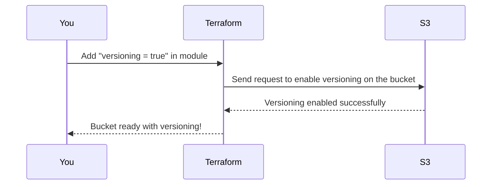

# Chapter 5: Versioning

Welcome to Chapter 5! 🎉 In the [previous chapter](04_public_access_blocking_.md), we learned how to prevent accidental public exposure of your S3 bucket using **Public Access Blocking**. Now, we’re going to unlock another essential feature of S3 that ensures you never lose critical data: **Versioning**. Let’s dive in! 🚀

---

## Why is Versioning Important?

Let’s imagine a situation:
You’re managing an S3 bucket that stores important documents for your company. One day, a team member accidentally overwrites a key file or deletes something they shouldn't have. 😱 What can you do?

If **versioning** is enabled, AWS S3 automatically keeps older versions of your files. It’s like an undo button for your storage! 🕒 You can:
1. Recover accidentally deleted files.
2. Retrieve previous versions of overwritten files.
3. Safeguard your data from unintended changes.

With versioning, your bucket turns into a time machine, letting you go back and recover older copies of your files. 🕰️

---

## Key Concepts: Understanding Versioning

### 1. What is Versioning?
When you enable versioning on a bucket, every time you upload or update a file, **S3 keeps the previous version** instead of replacing it. Each version of the file gets a unique ID, so nothing is ever lost.

Here’s how it works:
- Without Versioning: The latest version of the file **overrides** the previous one.
- With Versioning: All versions of the file are **retained**, and the latest becomes the "current version."

Imagine S3 is your notebook. Without versioning, writing on a page destroys everything written before. But with versioning, you copy every previous page before writing something new. 📖

---

### 2. How Deleted Files Work with Versioning
When versioning is enabled and you delete a file, it doesn’t actually disappear. Instead:
- **A delete marker** is added to the bucket, hiding the file from view.
- The older versions of the file are still securely stored and recoverable.

This ensures even "deleted" files can be recovered easily. 🛡️

---

### 3. How Versioning Affects Costs
While versioning is fantastic for safety, it **increases storage usage** because S3 keeps all file versions. To manage costs, you can pair versioning with [Lifecycle Rules](08_lifecycle_rules_.md) to remove older versions after a certain time.

---

## Enabling Versioning with `terraform-aws-mcaf-s3`

The `terraform-aws-mcaf-s3` module makes enabling versioning incredibly simple. Let’s see how!

### Example: Create a Versioned Bucket

Let’s create an S3 bucket with versioning enabled. Here’s how:

```hcl
module "versioned_bucket" {
  source      = "../.."         # Path to the module
  name_prefix = "versioned"     # Prefix for the bucket name
  versioning  = true            # Enable versioning
}
```

#### What’s Happening Here?
- `name_prefix`: Adds a prefix like `versioned-xxxxx` to your bucket name.
- `versioning = true`: Ensures versioning is enabled for this bucket.

### Step 1: Apply the Configuration
Run the Terraform commands to create the bucket:
```bash
terraform init    # Set up Terraform
terraform apply   # Create the versioned bucket
```

When this finishes, your bucket will automatically have versioning enabled. 🎉

---

### Testing Versioning

Once your bucket is created, test versioning with the AWS CLI:
1. **Upload a file**:
   ```bash
   aws s3 cp your_file.txt s3://<YOUR_BUCKET_NAME>
   ```

2. **Update the file**:
   Make changes to the file locally, then re-upload it with the same name:
   ```bash
   aws s3 cp your_file.txt s3://<YOUR_BUCKET_NAME>
   ```

3. **List all versions**:
   Use the following command to see all file versions:
   ```bash
   aws s3api list-object-versions --bucket <YOUR_BUCKET_NAME>
   ```

You’ll see the previous version alongside the latest one. 🥳

---

## How Versioning Works Inside the Module

Let’s explore what happens behind the scenes when you enable versioning in the `terraform-aws-mcaf-s3` module.

### High-Level Process

Here’s a step-by-step overview of what happens:



---

### Internal Implementation

The versioning settings are handled in the `terraform-aws-mcaf-s3` module automatically. Let’s break it down:

1. **Input Variable for Versioning**
   In `variables.tf`, the module defines a `versioning` variable:
   ```hcl
   variable "versioning" {
     type        = bool
     default     = true
     description = "Versioning is a means of keeping multiple variants of an object in the same bucket."
   }
   ```
   The default is `true`, so your bucket will have versioning enabled unless you explicitly disable it.

2. **Resource to Configure Versioning**
   The magic happens in `main.tf`. Here’s the relevant section:
   ```hcl
   resource "aws_s3_bucket_versioning" "default" {
     bucket = aws_s3_bucket.default.id

     versioning_configuration {
       status = var.versioning ? "Enabled" : "Suspended"
     }
   }
   ```
   - The `status` is set to `"Enabled"` when `versioning = true`.
   - This resource ensures the bucket tracks all file versions.

3. **Default Behavior**
   If you don’t customize this, the module **enables versioning by default** to align with AWS best practices.

---

## Costs and Best Practices

### 1. Monitor Storage Usage
Every file version adds to your total storage usage. To keep costs under control:
- Regularly audit your buckets.
- Use [Lifecycle Rules](08_lifecycle_rules_.md) to delete older versions automatically.

### 2. Combine with Logging
Enable [Logging](09_logging_configuration_.md) to keep track of who modifies or deletes file versions.

---

## Recap & What’s Next?

In this chapter, you learned:
- The importance of **versioning** for protecting your S3 data.
- How versioning works, including handling deletes and updates.
- How to enable versioning using the `terraform-aws-mcaf-s3` module.
- What happens under the hood and best practices for managing versioned buckets.

With versioning, your S3 buckets are now equipped to handle accidental deletes, overwrites, or any unintended changes. 🔒

Next up? Let’s solidify your bucket’s security with [Malware Protection](06_malware_protection_.md). 🛡️ See you in the next chapter! 🚀

---

Generated by [AI Codebase Knowledge Builder](https://github.com/The-Pocket/Tutorial-Codebase-Knowledge)
