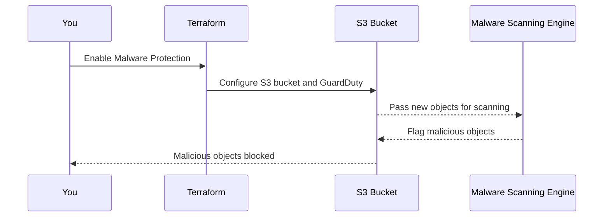

# Chapter 6: Malware Protection

Welcome to Chapter 6! 🎉 In the [previous chapter](05_versioning_.md), we explored how enabling **versioning** can help protect your data by keeping track of past versions and preventing accidental loss. Now, we’re going to add another layer of defense: **Malware Protection**.

Imagine you’re running a critical system where customers upload documents or spreadsheets to your S3 bucket. What if someone (accidentally or maliciously) uploaded harmful files, like malware or viruses? 😱 Without proper scanning, these files could harm your systems or even your customers.

This is where **Malware Protection** comes in—it scans your bucket for malicious files and ensures threats are detected and blocked, just like an antivirus system for your S3 bucket. Let’s dive in! 🚀

---

## Why is Malware Protection Important?

Think of your S3 bucket as a fully stocked library 📚. People deposit books (files) into this library daily. However, a few books might be filled with harmful content (malicious files). This puts your readers (users) at risk!

Malware Protection acts like a **librarian with a scanner**. Every time a book (file) enters the library, it’s scanned for harmful content. If something dangerous is found, the librarian flags it and locks it away so it doesn’t harm your readers.

Here’s why this is important:
1. **Detect and Block Threats**: You’re notified if a malicious file is uploaded, and access is blocked.
2. **Protect Your Systems**: Prevent harmful files from spreading or causing damage.
3. **Automatic Scans**: Files are scanned automatically—set it up once, and it runs without additional effort.

By enabling Malware Protection, you can sleep peacefully knowing your S3 bucket is secure. 🛡️

---

## How Malware Protection Works

Malware Protection uses **AWS GuardDuty Malware Protection**, a feature specifically designed to scan objects in your S3 bucket. Here’s an overview of what happens when Malware Protection is enabled:

1. **Automatic Scanning**: Every new file uploaded to the bucket is scanned by GuardDuty.
2. **Threat Detection**: If any malicious file is identified, it is tagged with a special label like `GuardDutyMalwareScanStatus=THREATS_FOUND`.
3. **Access Control**: Files marked as malicious cannot be accessed, downloaded, or manipulated in any way.

Let’s see how to set this up using the `terraform-aws-mcaf-s3` module.

---

## Enabling Malware Protection with the Module

Setting up Malware Protection with the module is straightforward. Here’s how:

### Example: Create a Malware-Protected Bucket

```hcl
module "malware_protected_bucket" {
  source            = "../.."              # Path to the module
  name_prefix       = "malware-protected"  # Prefix for bucket name
  malware_protection = {                    # Enable Malware Protection
    enabled = true
  }
}
```

### What’s Happening Here?
- **`name_prefix`**: This ensures the bucket name is unique by adding a prefix.
- **`malware_protection.enabled`**: This activates GuardDuty Malware Protection for the bucket.

### Step 1: Apply the Configuration
Deploy the infrastructure by running the following commands:

```bash
terraform init    # Initialize the project
terraform apply   # Deploy the malware-protected bucket
```

🎉 That’s it! GuardDuty Malware Protection is now enabled, and your bucket is secure.

---

## How to Test Malware Protection

To confirm Malware Protection is working, follow these steps:

1. **Upload a Clean File**:
   Use the AWS CLI to upload a harmless file to the bucket:
   ```bash
   aws s3 cp clean_file.txt s3://<YOUR_BUCKET_NAME>
   ```
   ✅ The file should upload successfully.

2. **Upload a Malicious File** (for testing purposes only!):
   You can use AWS-provided simulated testing files to emulate malicious behavior:
   ```bash
   curl -o eicar_com.txt https://secure.eicar.org/eicar.com.txt
   aws s3 cp eicar_com.txt s3://<YOUR_BUCKET_NAME>
   ```
   ❌ This file will trigger a malware scan alert, and access to it will be automatically restricted.

3. **Check the Object's Tags**:
   Run the following command to see if GuardDuty tagged the file as malicious:
   ```bash
   aws s3api get-object-tagging --bucket <YOUR_BUCKET_NAME> --key eicar_com.txt
   ```
   You should see a response like this:
   ```json
   {
     "TagSet": [
       {
         "Key": "GuardDutyMalwareScanStatus",
         "Value": "THREATS_FOUND"
       }
     ]
   }
   ```

Files marked as malicious are automatically **blocked** from being accessed. 🛑

---

## What Happens Under the Hood?

Here’s a step-by-step explanation of what happens internally when Malware Protection is enabled:

### High-Level Process



GuardDuty continuously monitors your bucket for malicious files and ensures no one can access them if detected. 🔒

---

## Internal Implementation

The `terraform-aws-mcaf-s3` module automates the complicated setup for Malware Protection. Let’s take a quick look at how it works internally:

### 1. Configuring Malware Protection
When you set the `malware_protection.enabled` flag to `true`, the module uses the `aws_guardduty_malware_protection_plan` resource to set up scanning:

```hcl
resource "aws_guardduty_malware_protection_plan" "default" {
  for_each = {"enabled" = true}

  protected_resource {
    s3_bucket {
      bucket_name = aws_s3_bucket.default.id
    }
  }

  actions {
    tagging {
      status = "ENABLED"
    }
  }
}
```

- **`protected_resource.s3_bucket.bucket_name`**: Specifies which bucket to monitor.
- **`actions.tagging`**: Adds tags (e.g., `GuardDutyMalwareScanStatus`) to detected files.

### 2. Denying Access to Malicious Files
The module creates an **S3 bucket policy** to block access to files flagged as "malicious." Here’s how it’s done:

```hcl
data "aws_iam_policy_document" "malware_protection_policy" {
  statement {
    effect  = "Deny"
    actions = ["s3:GetObject", "s3:GetObjectVersion"]
    resources = ["${aws_s3_bucket.default.arn}/*"]

    condition {
      test     = "StringEquals"
      variable = "s3:ExistingObjectTag/GuardDutyMalwareScanStatus"
      values   = ["THREATS_FOUND"]
    }
  }
}
```

Every file tagged as `GuardDutyMalwareScanStatus=MALICIOUS` is denied access by this policy.

---

## Practical Tips for Malware Protection

1. **Enable Logging**: Combine Malware Protection with S3 bucket logging (see [Logging Configuration](09_logging_configuration_.md)) to track file activity.
2. **Use Lifecycle Rules**: Automatically delete malicious files after a fixed period (see [Lifecycle Rules](08_lifecycle_rules_.md)).
3. **Scan Existing Files**: By default, GuardDuty scans new uploads. For historical files, you may need to arrange additional scanning procedures using AWS partners or other tools.

---

## Recap & What’s Next?

In this chapter, you learned:
- What Malware Protection is and why it’s critical for securing your S3 buckets.
- How to use the `terraform-aws-mcaf-s3` module to enable Malware Protection effortlessly.
- What happens under the hood when uploading files, including detection and access blocking.
- Practical ways to test and improve your bucket’s security.

With Malware Protection, your bucket is no longer just a safe place—it’s a **protected fortress** 🛡️.

In the [next chapter](07_replication_configuration_.md), we’ll look at another powerful feature: **Replication Configuration**, which helps you create backups of your bucket across AWS regions for added resilience. See you there! 🚀

---

Generated by [AI Codebase Knowledge Builder](https://github.com/The-Pocket/Tutorial-Codebase-Knowledge)
