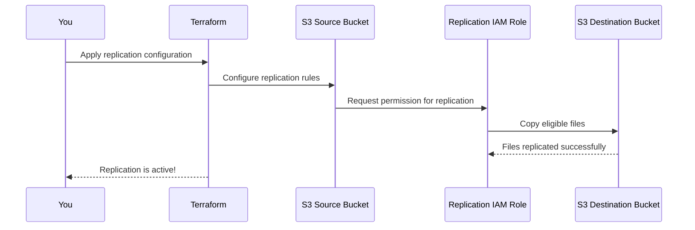

# Chapter 7: Replication Configuration

Welcome to Chapter 7! 🎉 In the [previous chapter](06_malware_protection_.md), we enhanced your S3 bucket security with **Malware Protection**, ensuring harmful files are automatically detected and flagged. Now, we’re going to dive into **Replication Configuration**. This is a powerful feature that allows you to *copy your S3 objects from one bucket to another bucket—even across AWS regions*. Imagine it as a backup mechanism or a way to maintain data resilience in case of failures. Let’s explore how it works! 🚀

---

## Why is Replication Important?

Imagine this scenario:
Your team is storing critical files in an S3 bucket located in `"us-east-1"` (North Virginia). Everything is going great, but one day, there’s an unexpected outage in that region. Or worse, you lose data due to an accidental delete! 😱 How do you ensure your files are safe and always accessible?

This is where **Replication Configuration** comes to the rescue. Replication ensures:
1. **Backup Across Regions**: Your data can be automatically copied from the source bucket to a destination bucket located in another AWS region (e.g., `"eu-west-1"`, Ireland).
2. **High Availability**: Even if a region goes offline, your data is available in another region.
3. **Compliance & Resilience**: Meet business or legal requirements to maintain data copies in specific geographic locations.

Replication is like having a photocopier that automatically makes copies of all your documents and stores them in a secure backup room in a different location. 🌍

---

## Understanding Key Concepts: Replication

Let’s break down the essential concepts before diving into how to set it up:

### 1. **Source Bucket and Destination Bucket**
- **Source Bucket**: This is the bucket where your data originates. Files will be copied *from* this bucket.
- **Destination Bucket**: This is where the data will be replicated *to*. It can be in the same AWS region or an entirely different one.

Think of these buckets as two storage boxes—your documents (files) move automatically from one to the other.

---

### 2. **IAM Role for Replication**
To replicate files, S3 needs permission to access both the source and destination buckets. This is achieved using an **IAM Role**—a special identity that grants permissions for the replication process. 🛠️

---

### 3. **Replication Rules**
Replication Rules define which objects are copied and how. For example:
- **All files** in the source bucket can be replicated.
- Only **encrypted files** or files with specific tags can be copied.

Think of this as deciding which documents to photocopy: *all of them, or only specific ones*. 📝

---

## Setting Up Replication with the `terraform-aws-mcaf-s3` Module

Now that we know the basics, let’s configure bucket replication using the module. We’ll set up a scenario where:
- Files from a source bucket in `"us-east-1"` are copied to a destination bucket in `"eu-west-1"`.
- Only encrypted files are replicated.

### Example: Basic Replication Configuration

```hcl
module "source_bucket" {
  source               = "../.."           # Use the terraform-aws-mcaf-s3 module
  name_prefix          = "source-data"     # Name of the source bucket
  replication_configuration = {
    iam_role_arn = "arn:aws:iam::111111111111:role/replication-role" # IAM Role for replication
    rules = {
      "1" = {
        id                  = "replicate-encrypted" # Rule ID
        dest_bucket         = "arn:aws:s3:::destination-bucket" # Destination bucket ARN
        dest_storage_class  = "STANDARD"          # Storage class for replicated files
        source_selection_criteria = {
          sse_kms_encrypted_objects = true # Only replicate encrypted objects
        }
      }
    }
  }
}
```

#### What Does This Do?
1. **Source Bucket**: The source bucket will be created with the `name_prefix` `"source-data"`.
2. **Replication Role**: Uses the specified IAM Role (`replication-role`) to carry out replication.
3. **Replication Rule**: Copies only **encrypted objects** to the destination bucket in `"eu-west-1"`.
4. **Destination Bucket**: Files are stored in the `"destination-bucket"`, and the replicated files will use the `STANDARD` storage class.

---

### Step-by-Step Output:

1. **Source Bucket**: A bucket named something like `source-data-abc123` will be created in the `"us-east-1"` region.
2. **Replication Applied**: The replication configuration links the source bucket to the destination bucket (`destination-bucket`) in another region.

---

## How Replication Works Under the Hood

Let’s dive under the hood to understand the sequence of events when replication is enabled.

### Step 1: High-Level Process

Here’s a simplified overview of how replication happens:



### What’s Happening at Each Step:
1. You enable replication in the Terraform module by defining the `replication_configuration`.
2. Terraform sets up replication rules on the source bucket, specifying which files to copy and where.
3. The source bucket uses the replication IAM Role to copy eligible files to the destination bucket.
4. The destination bucket stores replicated files, ensuring they are available in another region.

---

### Step 2: Behind-the-Scenes Code Breakdown

#### 1. IAM Role for Replication
The IAM Role must allow `s3:ReplicateObject`, `s3:ReplicateDelete`, and other permissions for both buckets. This is usually outside the module but can look like this:
```hcl
data "aws_iam_policy_document" "replication_policy" {
  statement {
    effect = "Allow"
    actions = [
      "s3:ReplicateObject",
      "s3:ReplicateDelete",
      "s3:ReplicateTags"
    ]
    resources = [
      "arn:aws:s3:::source-data-*/*",      # Source bucket
      "arn:aws:s3:::destination-bucket/*" # Destination bucket
    ]
  }
}
```

#### 2. Replication Rules in Terraform
Inside the module (`main.tf`), replication rules are implemented using the `aws_s3_bucket_replication_configuration` resource:

```hcl
resource "aws_s3_bucket_replication_configuration" "default" {
  role   = var.replication_configuration.iam_role_arn
  bucket = aws_s3_bucket.default.id

  rule {
    id       = "replication-rule"
    priority = 1
    status   = "Enabled"

    destination {
      bucket        = rule.value.dest_bucket
      storage_class = rule.value.dest_storage_class
    }

    source_selection_criteria {
      sse_kms_encrypted_objects {
        status = "Enabled"
      }
    }
  }
}
```

- **`role`**: The IAM Role ARN used for replication permissions.
- **`destination`**: Specifies the destination bucket and storage class.
- **`source_selection_criteria`**: Ensures only encrypted objects are replicated.

---

### Testing Replication
Once everything is set up, you can upload a few files to the source bucket and verify if they are replicated to the destination bucket.

#### Example Commands:
1. **Upload a file**:
   ```bash
   aws s3 cp encrypted-file.txt s3://<SOURCE_BUCKET_NAME>
   ```
2. **Check the destination bucket**:
   ```bash
   aws s3 ls s3://<DESTINATION_BUCKET_NAME>
   ```
You’ll see the replicated file in the destination bucket if it meets the rule criteria (e.g., encrypted with SSE-KMS).

---

## Recap & What’s Next?

In this chapter, we covered:
- **What replication is** and why it’s critical for resilience and backups.
- **Key concepts**, like source/destination buckets, IAM roles, and replication rules.
- How to use the `terraform-aws-mcaf-s3` module to configure replication.
- **What happens under the hood**, including IAM and replication rule implementations.

With replication enabled, your data is safer and more resilient than ever! 🔒

Next, we’ll explore how to optimize your data retention with **[Lifecycle Rules](08_lifecycle_rules_.md)**. These rules help manage storage costs by automatically archiving or deleting files based on age. See you there! 🚀

---

Generated by [AI Codebase Knowledge Builder](https://github.com/The-Pocket/Tutorial-Codebase-Knowledge)
