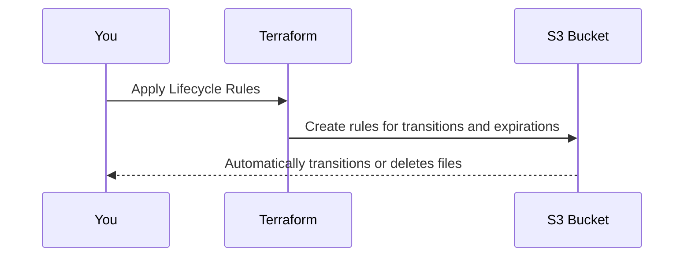

# Chapter 8: Lifecycle Rules

Welcome to Chapter 8! 🎉 In the [previous chapter](07_replication_configuration_.md), we explored how to set up **Replication Configuration** to back up your S3 bucket’s data across regions for resilience. But what if you only want to keep certain files around for a limited amount of time? Or optimize costs by automatically moving old files to cheaper storage? 🤔 Say hello to **Lifecycle Rules**! 🚀

---

## Why are Lifecycle Rules Important?

Imagine you’re managing an S3 bucket for a growing company that stores thousands of product images. Over time, older files become irrelevant or rarely accessed. Keeping them on standard storage can add unnecessary costs, but manually sorting and deleting these files is tedious.

What if you could automate this cleanup process, telling S3 to:
1. **Move old files** to cheaper storage like Glacier after 30 days.
2. **Delete very old files** (e.g., after 2 years).

This is exactly what Lifecycle Rules do! 🛠️ Think of them as a virtual janitor for your bucket:
- They automatically **transition files** to different storage classes based on age or size.
- They **expire files** by deleting them when they’re no longer needed.

---

## How Lifecycle Rules Work: Key Concepts

Lifecycle Rules might sound complex initially, but let’s break them down into **easy-to-understand concepts**.

### 1. **Transition**
This is like moving files to a drawer with cheaper rent!
You can set up rules to move objects to:
- **Standard-IA (Infrequent Access)**: For objects accessed rarely but still needed occasionally.
- **Glacier**: For very rarely accessed objects.
- **Deep Archive**: The cheapest but slowest storage option, for long-term archival.

For example:
“If a file hasn’t been accessed in **30 days**, move it to **Standard-IA**.”

---

### 2. **Expiration**
Think of expiration as shredding papers you no longer need!
You can set a rule to automatically delete:
- **Current objects** after a set number of days.
- **Previous versions** of objects if [Versioning](05_versioning_.md) is enabled.

For example:
“If a file hasn’t been accessed in **365 days**, delete it automatically.”

---

### 3. **Filter**
Filters help you selectively apply Lifecycle Rules by choosing:
- **File Prefix**: Apply rules only to files in folders like `/logs/`.
- **Tags**: Apply rules to files labeled with something like `Environment=Test`.

For example:
“Only delete files in the folder `backup/` or files tagged with `Environment=Temp`.”

---

## Using Lifecycle Rules with `terraform-aws-mcaf-s3`

Let’s set up Lifecycle Rules for an S3 bucket using the `terraform-aws-mcaf-s3` module. Here’s a simple use case:

**Use Case**:
Imagine a log storage bucket where files are:
1. Moved to Glacier after 30 days to save costs.
2. Automatically deleted after 1 year.

Here’s how we can configure this:

---

### Step 1: Add Lifecycle Rules to Your Module

```hcl
module "lifecycle_bucket" {
  source        = "../.."       # Path to the module
  name_prefix   = "lifecycle"   # Prefix for bucket name

  lifecycle_rule = [
    {
      id      = "glacier-transition-rule"   # Rule name
      enabled = true                        # Enable the rule

      transition = [                        # Transition to Glacier after 30 days
        {
          days          = 30
          storage_class = "GLACIER"
        }
      ]

      expiration = {                        # Delete files after 1 year (365 days)
        days = 365
      }
    }
  ]
}
```

**Explanation:**
1. **`id`**: A unique name to identify this rule.
2. **`enabled`**: Activates the rule.
3. **`transition`**: Moves files older than 30 days to Glacier storage.
4. **`expiration`**: Deletes files older than 1 year (365 days).

---

### Step 2: Apply the Configuration

Run the following commands to apply your Terraform file:
```bash
terraform init    # Initialize Terraform
terraform apply   # Apply the configuration
```

Once this completes:
- Files in the bucket will be automatically moved to Glacier after 30 days.
- Files older than 1 year will be deleted without manual intervention. 🎉

---

### Step 3: Test Lifecycle Rules

1. **Upload Some Files**:
   Add a few dummy files to your bucket for testing:
   ```bash
   aws s3 cp test-file.txt s3://<YOUR_BUCKET_NAME>
   ```

2. **Wait or Simulate Aging**:
   You can wait for the rules to trigger (30 days for transitions or 365 days for expiration). Unfortunately, there’s no “fast-forward” for testing, so you’ll need to verify asynchronously.

3. **Check Storage Class**:
   After 30 days, verify that files are moved to Glacier:
   ```bash
   aws s3api head-object --bucket <YOUR_BUCKET_NAME> --key test-file.txt
   ```
   You should see `"StorageClass": "GLACIER"` in the response.

4. **Verify File Deletion**:
   After another 335 days (for a total of 365), the file will be deleted automatically.

---

## How Lifecycle Rules Work Under the Hood

When you define a Lifecycle Rule, the magic happens in S3’s backend, but let’s simplify the process.

### High-Level Workflow

Here’s what happens when Lifecycle Rules are applied:



**Explanation**:
- Terraform sends your custom Lifecycle Rules to the S3 bucket.
- S3 takes care of monitoring object age and applying transitions/expirations for you.

---

### Internal Implementation: Simplified Code Walkthrough

The `terraform-aws-mcaf-s3` module uses the `aws_s3_bucket_lifecycle_configuration` resource to apply your Lifecycle Rules. Here’s the simplified implementation:

#### 1. Lifecycle Rules Defined in Terraform
**`main.tf`**:
```hcl
resource "aws_s3_bucket_lifecycle_configuration" "default" {
  bucket = aws_s3_bucket.default.bucket
  rule {
    id     = "ExampleRule"
    status = "Enabled"

    transition {
      days          = 30
      storage_class = "GLACIER"
    }

    expiration {
      days = 365
    }
  }
}
```

- **`bucket`**: Specifies the S3 bucket to apply the rule to.
- **`rule`**: Contains the lifecycle rule configuration (transition and expiration).
- **`transition`**: Moves files older than 30 days to Glacier.
- **`expiration`**: Deletes files older than 365 days.

---

## Practical Tips for Lifecycle Rules

1. **Cost Management**: Use transitions (like Glacier) to save money on large, rarely accessed datasets.
2. **Filter Intelligently**: Apply filters to only target files you don’t need every day (e.g., backups or logs).
3. **Enable Logging**: Combine with [logging](09_logging_configuration_.md) to monitor when Lifecycle Rules are applied.

---

## Recap & What’s Next?

In this chapter, we learned:
- **What Lifecycle Rules are** and how they help manage S3 storage automatically.
- How transitions and expirations work to optimize costs and clean up old data.
- How to use the `terraform-aws-mcaf-s3` module to configure Lifecycle Rules easily.
- What happens under the hood when Lifecycle Rules are applied.

Your S3 bucket can now automatically manage its files just like a **smart assistant**! 🧹

In the [next chapter](09_logging_configuration_.md), we’ll dive into **Logging Configuration** and learn how to track who’s accessing your bucket and how. See you there! 🚀

---

Generated by [AI Codebase Knowledge Builder](https://github.com/The-Pocket/Tutorial-Codebase-Knowledge)
