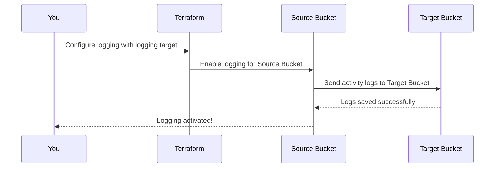

# Chapter 9: Logging Configuration

Welcome to Chapter 9! 🎉 In the [previous chapter](08_lifecycle_rules.md), we learned how to use **Lifecycle Rules** to optimize your S3 bucket by automatically transitioning or deleting objects based on age or other conditions. Now, let's explore how to keep track of **who is accessing your bucket and what they are doing** by enabling **Logging Configuration**.

Imagine you’re responsible for managing a bucket that stores your company’s sensitive data, like invoices or customer files. One day, your manager asks, "Who recently accessed the bucket?" Or worse, someone reports suspicious activity, and you need to investigate. Without logging, it’s like trying to identify footprints in a snowstorm… after the snow has melted. ❄️👣

With **Logging Configuration**, you can:
1. Track access to your bucket (like a surveillance camera for your storage).
2. Generate detailed logs to analyze usage and detect anomalies.
3. Meet compliance and auditing requirements with proper data access records.

Let’s dive in and enable logging for your S3 bucket! 🚀

---

## Why Enable Logging?

Think of logging as adding **security cameras and a visitor book** to your bucket. Every time someone (or something) interacts with your bucket, detailed records (logs) are generated and stored in another bucket for safekeeping.

Here’s how logging can help:
- **Understand Activity**: Find out who accessed your bucket, when, and what they did.
- **Troubleshoot Issues**: Diagnose unexpected behavior, such as unauthorized access or errors.
- **Meet Compliance Standards**: Certain regulations require organizations to maintain access logs for audits (e.g., PCI DSS, HIPAA).

For example:
Let’s say your bucket (`example-data-bucket`) is accessed multiple times daily. Logging allows you to save each access record in a designated logging bucket (`audit-logs-bucket`). This ensures you have a historical record of all activities for investigation or reporting.

---

## Key Concepts: Logging Configuration

Before we jump into the setup, let’s break down some important concepts:

### 1. **Source Bucket**
This is the bucket you want **to monitor**. Any access (read/write) to this bucket will be logged. For example, `example-data-bucket`.

---

### 2. **Target Bucket**
This is where the logs from the source bucket will be stored. It should be in the same AWS region for performance and cost reasons. For example, `audit-logs-bucket`.

---

### 3. **Log Format**
The logs contain detailed information like:
- **Requester Info**: Who accessed the bucket.
- **IP Address**: Where the request came from.
- **Operation Details**: What was done (e.g., uploading, downloading).
- **Timestamp**: When the activity occurred.

The logs are named in a structured format. You can define either:
- **Simple Prefix**: Logs are stored using a basic folder-like structure (e.g., `logs/2023-10-12`).
- **Partitioned Prefix**: Provides a more organized format by separating logs by account, region, bucket, and date.

---

## Step-by-Step: Enabling Logging with the Module

Let’s set up **logging** for a bucket. Here’s the scenario:
- **Source Bucket**: `example-data-bucket` (where activity is monitored)
- **Target Bucket**: `audit-logs-bucket` (where logs are stored)
- Use a **partitioned prefix** format for clear organization.

---

### Step 1: Define the Logging Configuration

Here’s a simple Terraform configuration to enable logging:

```hcl
module "audit_logs" {
  source = "../.."

  name_prefix = "audit-logs"               # Create a log storage bucket
}

module "data_bucket" {
  source = "../.."

  name_prefix = "data-bucket"              # Create the source bucket

  logging = {                              # Define logging
    target_bucket = module.audit_logs.name # Target: logs stored here
    target_prefix = "logs/"                # Logs saved under "logs/" path
    target_object_key_format = {
      format_type           = "partitioned" # Use partitioned logging format
      partition_date_source = "DeliveryTime"
    }
  }
}
```

---

### Step 2: Apply the Configuration

Run the following commands to create the buckets and configure logging:

```bash
terraform init    # Initialize the project
terraform apply   # Deploy the logging configuration
```

---

### Step 3: Verify the Logs

1. **Upload or Access Files**: Interact with the `data-bucket` using AWS CLI or the AWS Console.
2. **Check the Target Bucket**: Navigate to the `audit-logs` bucket and look under the `logs/` prefix. You should see log files named something like:
   ```
   logs/123456789012/eu-west-1/data-bucket/2023/10/12/
   ```
3. **Analyze a Log File**: Download and open a log file (stored in plain text). It contains records similar to:
   ```
   2023-10-12 08:00:00 192.168.1.1 arn:aws:iam::123456789012:user/Alice REST.GET.OBJECT example.txt 200
   ```

This log entry means:
- **Timestamp**: `2023-10-12 08:00:00`
- **Requester IP**: `192.168.1.1`
- **User**: `Alice`
- **Operation**: Downloaded file `example.txt` using REST API.

Congratulations! 🎉 You’ve enabled logging for your S3 bucket.

---

## What Happens Under the Hood?

Let’s break down what happens when you set up logging:

### Sequence of Events



### Internal Implementation

The `terraform-aws-mcaf-s3` module configures logging using the Terraform `aws_s3_bucket_logging` resource. Here’s a simplified view:

#### 1. Define the Logging Configuration
In the `main.tf` file, the module accepts a logging block as input:
```hcl
resource "aws_s3_bucket_logging" "default" {
  bucket        = aws_s3_bucket.default.id       # Source bucket
  target_bucket = var.logging.target_bucket      # Target bucket
  target_prefix = var.logging.target_prefix      # Path for logs

  dynamic "target_object_key_format" {
    for_each = var.logging.target_object_key_format ? { create = true } : {}

    content {
      partitioned_prefix {
        partition_date_source = var.logging.target_object_key_format.partition_date_source
      }
    }
  }
}
```

- **`bucket`**: Source bucket ID (e.g., `data-bucket`).
- **`target_bucket`**: Where the logs are saved (e.g., `audit-logs`).
- **`target_prefix`**: Path to organize logs in the target bucket.

#### 2. Handle Logging Permissions
To allow the source bucket to write logs to the target bucket, the module adds an appropriate bucket policy:
```hcl
data "aws_iam_policy_document" "logging_policy" {
  statement {
    actions    = ["s3:PutObject"]
    effect     = "Allow"
    resources  = ["arn:aws:s3:::<TARGET_BUCKET>/*"]
    principals {
      type        = "Service"
      identifiers = ["logging.s3.amazonaws.com"]
    }
  }
}

resource "aws_s3_bucket_policy" "target_policy" {
  bucket = var.logging.target_bucket
  policy = data.aws_iam_policy_document.logging_policy.json
}
```

This lets S3’s logging service deposit log files into the target bucket.

---

## Practical Tips for Logging

1. **Use a Dedicated Logs Bucket**: Always store logs in a separate bucket to avoid infinite logging loops (where logs are logged recursively).
2. **Enable Versioning for Logs**: Protect log files from accidental deletion or overwrites with [Versioning](05_versioning.md).
3. **Regularly Audit Logs**: Check logs periodically to ensure no unauthorized access is happening.

---

## Recap & What’s Next?

In this chapter, we learned:
- What **Logging Configuration** is and how it helps monitor S3 bucket activity.
- Key concepts like source buckets, target buckets, and log formats.
- How to enable logging using the `terraform-aws-mcaf-s3` module.
- What happens under the hood when logging is configured.

---

With logging enabled, your bucket now has an **activity tracker**, making it easier to audit, debug, and secure your storage. 🕵️‍♂️
In the [next chapter](10_outputs_or_exported_properties.md), we will explore **Outputs or Exported Properties**, which let you access important information about your bucket. See you there! 🚀

---

Generated by [AI Codebase Knowledge Builder](https://github.com/The-Pocket/Tutorial-Codebase-Knowledge)
