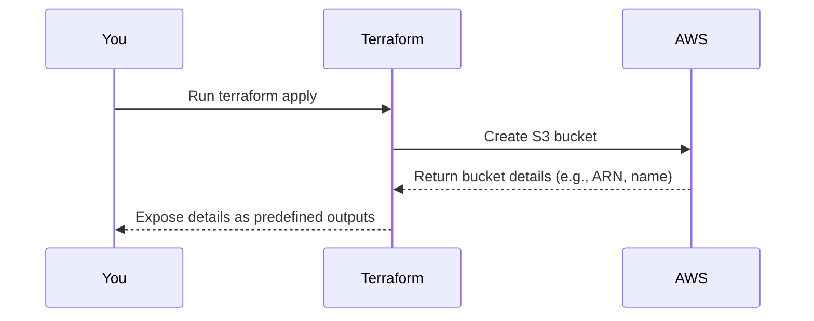

# Chapter 10: Outputs or Exported Properties

Welcome to Chapter 10! 🎉 In the [previous chapter](09_logging_configuration_.md), we explored how you can enable logging for your S3 bucket to monitor access and activity. Now, let’s shift gears to a new topic: understanding **Outputs or Exported Properties**.

Imagine you’ve used the `terraform-aws-mcaf-s3` module to create an S3 bucket successfully. That’s great! But here’s the thing—how do you use it in **other parts of your Terraform project**? 🤔 For example:

- What if you need the **bucket name** to configure permissions elsewhere?
- Or the **bucket ARN** to attach it to another AWS service like CloudFront?

This is where **Outputs** come into play. They act as a "summary report card," exporting critical details about the resources created by the module so that you can reference them wherever you need them. Let’s learn how to use them! 🚀

---

## Why Are Outputs Important?

Outputs are like *post-it notes* your Terraform module gives you after it finishes running. These notes contain vital information you’ll likely use elsewhere in your configuration. For example:

### Central Use Case:
Imagine you’re setting up an S3 bucket and then want to:
1. **Grant read/write permissions** to an EC2 instance.
2. Set up a **Bucket Policy** somewhere else using the bucket’s **ARN**.
3. Create other AWS services (e.g., Lambda, CloudFront) that rely on bucket properties.

Without outputs, you’d have to dig through the AWS Console manually to find these details or hard-code values, which is error-prone. Outputs eliminate this hassle by exporting them programmatically!

---

## Key Concepts: Outputs in Terraform

### 1. **What Are Outputs?**
Outputs are snippets of information Terraform provides **after a resource is created or updated**. Using outputs, you can:
- Pass details (e.g., bucket name, ARN) to other parts of your infrastructure.
- Print useful information to your console after `terraform apply`.
- Debug your configuration during development.

---

### 2. **Predefined Outputs in the Module**
The `terraform-aws-mcaf-s3` module comes with some helpful predefined outputs:
- **`arn`**: The Amazon Resource Name of the bucket.
- **`id`**: The name of the bucket.
- **`name`**: An alias for the bucket name (same as `id`).

These three outputs are enough for most use cases—whether you’re configuring permissions, linking other services, or simply debugging your setup.

---

## Example: Using Outputs in Your Project

Let’s look at a concrete use case! We’ll create an S3 bucket and use the **bucket ARN** (an output) to set up an IAM Role with access to that bucket.

---

### Step 1: Create the S3 Bucket

First, create a Terraform configuration for your bucket:

```hcl
module "example_bucket" {
  source = "../.."

  name_prefix = "my-example-bucket" # Create a bucket with this prefix
}
```

After you **apply** this configuration using Terraform (`terraform apply`), the module will generate outputs for the bucket.

---

### Step 2: Reference Outputs to Configure Other Resources

Let’s say you want to configure an IAM Role that allows an application to read files from the bucket. You’ll need the bucket’s ARN, which is exported as an output by the module. Here’s how to do it:

```hcl
resource "aws_iam_policy" "read_bucket_policy" {
  name   = "ReadBucketPolicy"
  policy = jsonencode({
    Version = "2012-10-17",
    Statement = [
      {
        Effect = "Allow",
        Action = ["s3:GetObject"],
        Resource = "${module.example_bucket.arn}/*"
      }
    ]
  })
}
```

**What’s Happening Here?**
- **`module.example_bucket.arn`**: This is how you reference the bucket ARN output from the module.
- The policy allows read access (`s3:GetObject`) to all objects in the bucket.

---

### Step 3: Print Outputs for Debugging

Sometimes, you simply want to log the outputs for visibility (e.g., during development). You can configure Terraform to print specific outputs to your console like this:

```hcl
output "bucket_arn" {
  value = module.example_bucket.arn  # Print the bucket ARN
}

output "bucket_name" {
  value = module.example_bucket.name # Print the bucket name
}
```

When you run `terraform apply`, you’ll see the outputs like this:

```plaintext
Outputs:

bucket_arn = "arn:aws:s3:::my-example-bucket-12345"
bucket_name = "my-example-bucket-12345"
```

This is super helpful during development or debugging!

---

## What Happens Under the Hood?

To understand how outputs work inside the module, let’s break it down step-by-step.

### High-Level Process

Here’s what happens when you use outputs:



---

### Internal Implementation

The `terraform-aws-mcaf-s3` module exports outputs as shown in its `outputs.tf` file. Here’s the simplified code:

#### 1. Exporting the Bucket ARN
```hcl
output "arn" {
  value       = aws_s3_bucket.default.arn
  description = "ARN of the bucket"
}
```

This tells Terraform to expose the **ARN** of the S3 bucket (created via `aws_s3_bucket.default`) as an output. When you refer to `module.<module_name>.arn`, this is the value you’re accessing.

#### 2. Exporting the Bucket Name
```hcl
output "id" {
  value       = aws_s3_bucket.default.id
  description = "Name of the bucket"
}
```

The `id` output contains the bucket’s name. This is helpful when you need the raw bucket name to configure other resources.

#### 3. Output Aliases
The module also includes an alias for the bucket name by re-exporting it as `name`:
```hcl
output "name" {
  value       = aws_s3_bucket.default.id
  description = "Name of the bucket"
}
```

This ensures consistent naming conventions for users of the module.

---

## Practical Tips for Working with Outputs

1. **Avoid Hardcoding Names**: Always use outputs instead of hardcoding values like ARNs or bucket names. This reduces human error and makes your code reusable.
2. **Document Your Outputs**: Add descriptions to your outputs if you create new ones inside custom modules. This makes it easier for others (and future you!) to understand your configuration.
3. **Debug Using `terraform output`**: Run `terraform output` after applying your configuration to see available outputs and their values.

---

## Recap & What’s Next?

In this chapter, you learned:
- What **Outputs or Exported Properties** are and why they’re useful.
- How outputs help you reference important details like the ARN or name of your bucket.
- How to use outputs in practical scenarios, like setting up IAM policies.
- What happens under the hood when outputs are generated by the module.

With the power of outputs, you can now seamlessly connect your S3 bucket to other parts of your infrastructure. 🛠️

This concludes the tutorial! By now, you’ve mastered everything from creating an S3 bucket to securing it, automating its behavior, and integrating it with other systems. 🎉 You're ready to build resilient, secure, and cost-effective solutions using the `terraform-aws-mcaf-s3` module. Happy Terraforming! 🚀

---

Generated by [AI Codebase Knowledge Builder](https://github.com/The-Pocket/Tutorial-Codebase-Knowledge)
