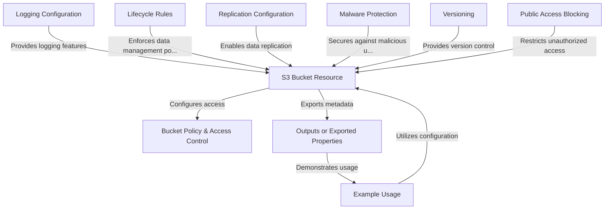

# Tutorial: terraform-aws-mcaf-s3

The `terraform-aws-mcaf-s3` project is a **Terraform module** designed to simplify the creation and management of **AWS S3 buckets**. It provides out-of-the-box support for functionalities like **bucket policies**, **access control**, **logging**, **encryption**, **versioning**, and other powerful features. The module abstracts complex configurations and offers **predefined examples** to speed up deployment, making it beginner-friendly yet comprehensive for advanced use cases. Features like *malware protection* and *public access blocking* ensure **security** and **compliance** with industry standards.

**Source Repository:** [None](None)

## Chapters

1. [Example Usage
](01_example_usage_.md)
2. [S3 Bucket Resource
](02_s3_bucket_resource_.md)
3. [Bucket Policy & Access Control
](03_bucket_policy___access_control_.md)
4. [Public Access Blocking
](04_public_access_blocking_.md)
5. [Versioning
](05_versioning_.md)
6. [Malware Protection
](06_malware_protection_.md)
7. [Replication Configuration
](07_replication_configuration_.md)
8. [Lifecycle Rules
](08_lifecycle_rules_.md)
9. [Logging Configuration
](09_logging_configuration_.md)
10. [Outputs or Exported Properties
](10_outputs_or_exported_properties_.md)

---

Generated by [AI Codebase Knowledge Builder](https://github.com/The-Pocket/Tutorial-Codebase-Knowledge)
